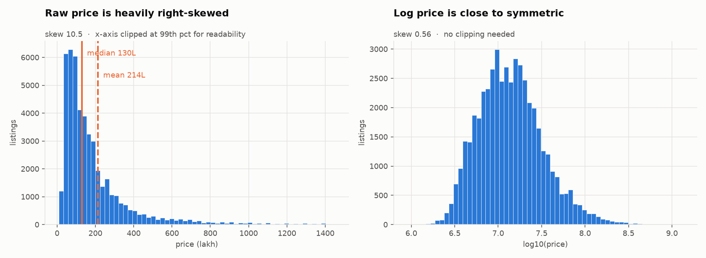
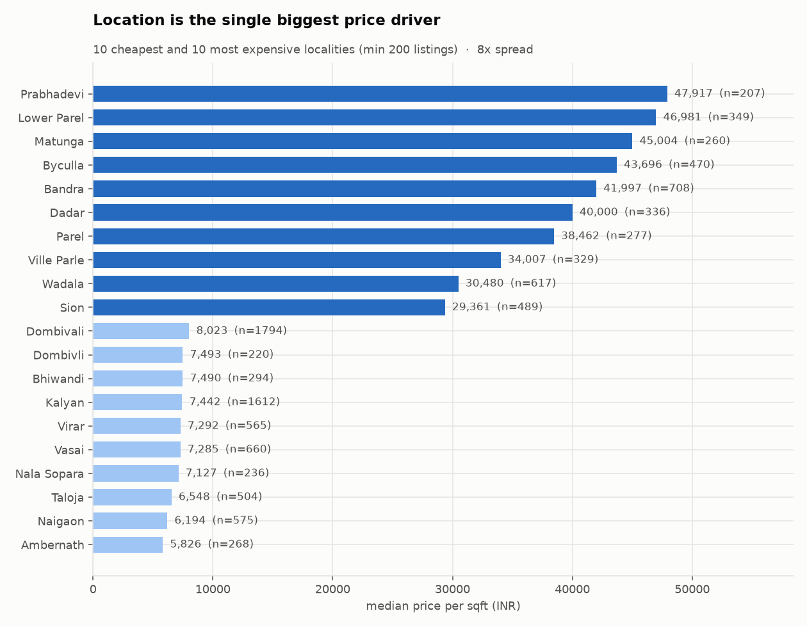
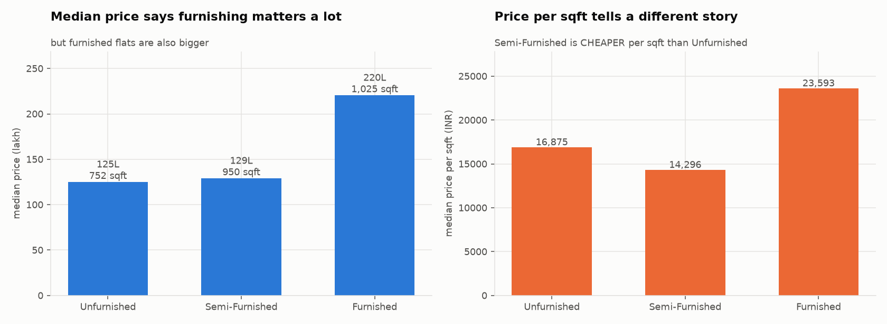

# Mumbai House Price Predictor

Predicts residential property asking prices in the Mumbai Metropolitan Region
from 51,706 cleaned listings.

**Median error: 13.2%** on 10,880 properties in 3,763 buildings the model had
never seen. 68% of estimates land within 20% of the listed price.

```
Streamlit app → predict_price() → saved sklearn Pipeline → estimate + range + warnings
```

---

## Contents

- [Overview](#overview) · [Problem statement](#problem-statement) · [Dataset](#dataset)
- [Data cleaning](#data-cleaning) · [EDA](#exploratory-data-analysis) · [Feature engineering](#feature-engineering)
- [Why the split matters](#why-the-split-matters) · [Models](#models) · [Evaluation](#evaluation)
- [Final model](#final-model) · [Installation](#installation) · [Usage](#usage)
- [Example prediction](#example-prediction) · [Limitations](#limitations) · [Future work](#future-improvements)

---

## Overview

An end-to-end regression project: raw scraped listings to a deployed web app.

The interesting parts are not the model. They are the places where the
obvious approach gives a number that is wrong in a way nothing warns you
about. This README documents three of those, because catching them is what
the project is actually about:

| What looked true | What was true |
|---|---|
| A random train/test split is fine | It made every score **12% too good** — 74% of rows share a building with another row |
| The building-name feature improves the model by 11% | On a building-aware split it makes the model **7% worse**. The gain was memorisation |
| Removing 636 bad rows improves MAE by 6.2% | It improves it by **0.01 lakh**. The first test deleted those rows from the exam as well as the study material |

## Problem statement

Given a property's locality, size, room counts, age and furnishing, estimate
its asking price.

**Regression, not classification** — the target is a continuous rupee amount,
so there is no "accuracy". Success is measured as percentage error, and the
model has to beat what a person could do with a lookup table.

## Dataset

[Mumbai House Price Data (70k entries)](https://www.kaggle.com/datasets/kevinnadar22/mumbai-house-price-data-70k-entries) — Kaggle.

**Not included in this repository** (licensing, and 8.5 MB of data does not
belong in Git). Download it and place it at:

```
data/raw/mumbai-house-price-data-raw.csv
```

| | |
|---|---|
| Raw rows | 71,938 |
| After cleaning | **51,706** |
| Columns used | 17 features |
| Localities | 403 (top 200 kept, rest grouped) |
| Price range | ₹6 lakh – ₹135 crore |
| Median price | ₹1.2 crore |

**These are asking prices, not confirmed sale prices.** Asking prices are
systematically above what a property actually sells for. Every number in this
project should be read with that in mind.

## Data cleaning

`python src/data_cleaning.py data/raw/<file>.csv data/processed/mumbai_clean.csv`

pandas reported **zero missing values in every column**. That was misleading.

| Issue found | Rows | Action |
|---|---:|---|
| **`price_per_sqft` = `price ÷ area` exactly** | 100% | Dropped — direct target leakage |
| Exact duplicate rows | 20,171 (28%) | Removed. One row appeared **59 times** |
| Duplicates created *by* dropping columns | 9 | A second dedup pass, last |
| `total_floors` = 1 | 99.9% | Dropped — carries no information |
| Blank `title` strings (not NaN) | 11,595 | Converted to real NaN |
| `age` = 0, `balcony_num` = 0 | 61% / 91% | Kept, plus a "missing" flag — we cannot know if 0 means "new" or "not stated" |
| Price = 2,147,483,647 | 2 | Removed — that is 2³¹−1, an integer overflow, not a price |
| Coordinates in Delhi, Kolkata, Pune | 154 | Coordinates nulled, **rows kept** |

Two decisions worth calling out:

**The coordinate bounding box is deliberately wide.** A tight box around
Mumbai city flagged 584 rows — including genuine Palghar and Vasai listings.
The wide box catches only the 154 that are in other cities entirely.

**Rows with `bedrooms = 0` were not deleted.** Both are Studio Apartments,
where zero bedrooms is correct. A naive "drop rows where bedrooms == 0" rule
would have destroyed valid data.

## Exploratory data analysis

`python src/eda.py data/processed/mumbai_clean.csv` · notebook: `notebooks/02_eda.ipynb`



Price skew is **10.53**. Taking logs drops it to **0.35**. Mean (₹2.02 Cr)
sits 68% above median (₹1.2 Cr).



**Location dominates.** A 13× spread in price per square foot between
Prabhadevi (₹47,768) and Neral (₹3,604) — and that is *per sqft*, so it is
not a size effect. Locality alone explains **63.7%** of the variance in log
price; area explains 47.6%.



**The furnishing trap.** By total price, furnished flats cost 83% more. By
price per square foot, Semi-Furnished is *cheaper* than Unfurnished. The gap
in the first chart is mostly size and location — furnishing is a marker of an
expensive property, not a cause of one. The same confound appears in `age`:
older buildings are more expensive per sqft, because old buildings are in
South Mumbai and new construction is in the outer suburbs.

## Feature engineering

`src/feature_engineering.py` — 17 features. **One rule: if the app's user
cannot supply it, it is not a feature.**

| Feature | Notes |
|---|---|
| `area`, `bedroom_num`, `bathroom_num`, `balcony_num`, `age` | Direct from the user |
| `latitude`, `longitude` | Looked up from the locality |
| `dist_nariman_km`, `dist_bkc_km`, `dist_cbd_km` | Haversine distance to Mumbai's two business districts |
| `age_is_zero`, `has_balcony` | Missing-value indicators |
| `rooms_total`, `bath_per_bed` | Simple combinations |
| `locality_grouped`, `property_type`, `furnished` | Categorical |

**Engineered features gained 0.9%, and that is reported honestly.**
`dist_cbd_km` correlates −0.65 with price per sqft and is genuinely
informative — add it to a model with no coordinates and MAE improves from
41.10 to 37.24 lakh. But this model already has latitude and longitude, and a
tree can carve up a map by itself. *A feature can be informative and still
useless if the model already has that information in another form.*

One candidate, `area_per_bed`, made the model measurably worse and was
deleted.

**Banned by an assertion:** `price_per_sqft` (leakage), `title` (see below).

## Why the split matters

`src/split_data.py` — the single most consequential decision in the project.

**74% of rows share a building with another row.** The largest single
building has 139 listings. A random split scatters them across both sides, so
the model can recall a building's price rather than reason about it.

| Same model, same features | MAE |
|---|---:|
| Random 5-fold CV | 36.65 L |
| **Group 5-fold CV (split by building)** | **41.09 L** |

Every result before this correction was about **12% optimistic**.

This also settled the `title` question. Target-encoding the building name
looked like an 11% gain:

| Split | Without `title` | With `title` |
|---|---:|---:|
| Random | 36.65 L | **32.54 L** — looks like +11% |
| Group | 41.09 L | **43.89 L** — actually −7% |

The entire gain was memorisation. On a building it has never seen, the
feature is noise and the model does worse. `title` stays banned.

## Models

`python src/train_models.py data/processed/train.csv` — all scores from
5-fold GroupKFold on training data only.

### Baselines first

| Baseline | MAE |
|---|---:|
| Global median rate | 110.51 L |
| **Locality median rate** — what a broker does mentally | **55.86 L** |
| Linear regression, all 17 features | 53.94 L |

Linear regression beats the lookup table by **3.4%**. Reporting "R² = 0.74"
without that comparison would have sounded respectable while being almost
entirely reproducible with a calculator.

### Real models

| Model | MAE | RMSE | R² | fold SD | Time |
|---|---:|---:|---:|---:|---:|
| Ridge | 53.96 L | 174.31 | 0.745 | 3.75 | 1 s |
| Lasso | 55.36 L | 174.70 | 0.744 | 3.68 | 37 s |
| Decision Tree | 48.35 L | 162.42 | 0.779 | 2.34 | 2 s |
| Random Forest | 42.34 L | 145.44 | 0.822 | 2.35 | 84 s |
| Extra Trees | 42.56 L | 150.42 | 0.810 | 3.02 | 66 s |
| Gradient Boosting | 46.60 L | 150.98 | 0.809 | 2.83 | 97 s |
| **HistGradientBoosting** | 42.70 L | **143.63** | **0.827** | 2.66 | 17 s |
| XGBoost | **42.18 L** | 146.35 | 0.820 | 2.90 | 9 s |

**21.8% better than the best baseline.** Linear models underfit — Phase 5
showed the BHK curve is convex (5 BHK costs 15× a 1 BHK, not 5×) and a
straight line cannot follow it.

**Hyperparameter tuning gained 0.2–1.1%** — inside the measurement noise
(CV standard error is 1.19 lakh). Target choice was worth ~15% and the model
family ~22%. Tuning is polish, not the lever.

## Evaluation

**Primary metric: median absolute percentage error.** Chosen because users
feel percentage error, and the median is not distorted by the luxury tail.

Different metrics crown different winners on the same predictions, which is
why the choice has to be made deliberately:

| | MAE | RMSE | R² | MedAPE | bias | ≤10% |
|---|---:|---:|---:|---:|---:|---:|
| Random Forest | 42.34 | 145.44 | 0.822 | **13.18%** | **−3.94** | **40.1%** |
| HistGB | 42.70 | **143.63** | **0.827** | 13.48% | −5.34 | 37.4% |
| XGBoost | **42.18** | 146.35 | 0.820 | 13.57% | −5.57 | 38.4% |

**Bias is always reported.** It is the only metric that keeps the sign — MAE,
RMSE, R² and MAPE all discard it, so "always 5 lakh low" looks identical to
"randomly 5 lakh out". All three models under-predict.

**A single split cannot tell these models apart.** Same model, ten different
80/20 splits: MAE ranged from 41.48 to 47.93 lakh. The models differ by 0.52
lakh. Cross-validation is not optional here.

## Final model

**`HistGradientBoostingRegressor`**, tuned. Test set opened once.

| Metric | Cross-validation | **Test set** |
|---|---:|---:|
| Median APE | 13.48% | **13.22%** |
| MAE | 42.23 L | 35.72 L |
| RMSE | — | 90.15 L |
| R² | — | **0.8598** |
| Bias | −5.34 L | −0.90 L |
| Within 10% | — | **39.7%** |
| Within 20% | — | **68.0%** |

CV predicted 13.48%; the truth was 13.22%. **That agreement is the real
result** — it means the group split, the pipeline discipline and keeping the
test set sealed all worked.

MAE improved from 42.23 to 35.72 without any change to the model, because the
test set happens to have a lighter luxury tail. Median APE is not affected by
the tail and barely moved — which is exactly why it was chosen as the primary
metric.

### Why not Random Forest, which scored better?

Random Forest won on median APE by 0.30 percentage points, verified with a
paired fold-by-fold comparison (5 wins out of 5, so the gap is real).

| | Random Forest | HistGB |
|---|---:|---:|
| Median APE | 13.18% | 13.48% |
| Saved file | 54.8 MB | **1.6 MB** |
| Memory loaded | 162.8 MB | **3.6 MB** |
| One prediction | 47.8 ms | **6.3 ms** |

0.30 percentage points means the typical error on a ₹1 crore flat moves from
₹13.48 lakh to ₹13.18 lakh — **₹30,000 on a crore**, which no user perceives.
The cost is 45× the memory on a free tier that provides about 1 GB.

*If this were a nightly batch job with no memory limit, Random Forest would
win. It is a web app, so it does not.*

### Where the model should not be trusted

| Segment | Tested | Median error |
|---|---:|---:|
| Under ₹2 crore | 7,713 | **12.6%** |
| ₹2–10 crore | 2,992 | 14.5% |
| Over ₹10 crore | 175 | **19.6%** |
| Over 2,500 sqft | 249 | **21.4%** |
| 4 BHK and larger | 566 | **18.3%** |

The ten worst predictions in the dataset are all the same thing: 4–6 BHK,
5,000–10,000 sqft, in Marine Lines, Colaba, Malabar Hill or Juhu. There are
26 such properties in 40,826 training rows, and what separates a ₹60 crore
Colaba flat from a ₹130 crore one — sea view, floor, building prestige — is
not in the data. **The app warns on every one of these cases.**

## Installation

```bash
git clone https://github.com/<your-username>/house-price-predictor.git
cd house-price-predictor

conda create -n houseprice python=3.11 -y
conda activate houseprice

pip install -r requirements.txt          # to run the app
pip install -r requirements-dev.txt      # to retrain and test
```

Then download the [dataset](https://www.kaggle.com/datasets/kevinnadar22/mumbai-house-price-data-70k-entries)
to `data/raw/mumbai-house-price-data-raw.csv`.

## Usage

```bash
python run_pipeline.py --check     # which outputs are stale?
python run_pipeline.py             # clean → features → split → train  (~6 min)
pytest                             # 92 tests, ~2 s
streamlit run app/app.py           # the app
```

`run_pipeline.py` exists because of a real bug: a threshold was changed and
the cleaning script never re-run, so a stale CSV silently cost 3,413 rows. A
stale pipeline produces no error message. This one checks timestamps.

### In Python

```python
from src.predict import predict_price

result = predict_price(
    locality="Andheri", area_sqft=900, bedrooms=2, bathrooms=2,
    balconies=1, age_years=5, furnishing="Semi-Furnished",
)
print(result["estimate_text"])   # 'Rs 2.57 crore'
print(result["range_text"])      # 'Rs 2.20 crore to Rs 2.94 crore'
print(result["warnings"])        # []
```

Invalid input raises `InvalidInput` with a message written for a user:

```python
predict_price(locality="Andheri", area_sqft=-100, bedrooms=2, bathrooms=2)
# InvalidInput: Area must be a positive number.
```

## Web application

Built with Streamlit. It imports `predict_price` and performs no machine
learning of its own — every number, threshold and warning comes from one
place, so the app cannot drift out of sync with the model.

It never shows a bare figure. Every estimate carries a range, the locality's
own median rate for comparison, and any warnings that apply. The accuracy
table and the limitations are on the page, not buried in this file.

## Example prediction

| Input | Estimate | Range | Warnings |
|---|---|---|---|
| Andheri, 900 sqft, 2 BHK | ₹2.56 crore | ₹2.19 – 2.93 Cr | none |
| Badlapur, 550 sqft, 1 BHK | ₹22.0 lakh | ₹19.2 – 24.8 L | none |
| Bandra, 1,800 sqft, 3 BHK, furnished | ₹9.52 crore | ₹8.14 – 10.9 Cr | none |
| Malabar Hill, 4,500 sqft, 4 BHK | ₹51.10 crore | ₹40.2 – 62.0 Cr | **4 warnings** |

## Limitations

1. **Asking prices, not sale prices.** Listings show what a seller wants.
   Actual transaction prices are usually lower.
2. **The area unit is unknown.** The dataset never states whether `area` is
   carpet, built-up or super built-up. In Indian real estate these differ by
   20–40% for the same flat, so part of the error is measurement
   inconsistency that no model can remove.
3. **No listing dates.** The model cannot account for market movement, and a
   time-based split — the correct evaluation for price data — was impossible.
4. **Unreliable above ₹10 crore.** 26 training examples above ₹50 crore.
5. **Missing the features that matter at the top of the market:** floor
   number, sea view, building age and brand, parking, society quality,
   maintenance charges.
6. **Mumbai only.** The distance features are hard-coded to two Mumbai
   business districts.
7. **192 rows have implausible labels** (e.g. a 2,200 sqft Thane flat listed
   at ₹45 lakh — ₹2,045/sqft). Removing them from training did not help, so
   they remain, documented.
8. **One small leak, disclosed:** Phase 4's outlier thresholds were chosen by
   looking at the whole dataset, including future test rows. It affects 0.10%
   of rows and the thresholds target impossible values rather than
   performance, but "almost leak-free, and here is the exception" is the
   honest answer.

## Future improvements

- **Prediction intervals** via quantile regression, so the range is derived
  per-property rather than from a segment average
- **Scrape fresh listings** with dates, enabling a time-based split
- **Better location encoding** — spatial smoothing or embeddings, since
  geography is 75% of the model's importance
- **Separate model for luxury**, or an explicit refusal above a threshold
- FastAPI backend, Docker, scheduled retraining, drift monitoring

## Technologies used

**Python 3.11** · pandas · NumPy · scikit-learn · joblib · Streamlit ·
matplotlib · pytest

`HistGradientBoostingRegressor`, `Pipeline`, `ColumnTransformer`,
`OneHotEncoder`, `SimpleImputer`, `GroupKFold`, `GroupShuffleSplit`,
`RandomizedSearchCV`, `permutation_importance`

## Project structure

```
├── data/raw/, data/processed/   not in git — regenerated by run_pipeline.py
├── notebooks/02_eda.ipynb       step-by-step exploration
├── src/                         15 modules, one per stage
│   ├── preprocessing.py         THE shared pipeline — everything imports this
│   ├── predict.py               validation + warnings, the public API
│   └── train_final.py           the only file that opens test.csv
├── app/app.py                   Streamlit application
├── models/                      pipeline (1.6 MB) + model card + locality lookup
├── tests/                       92 tests
├── reports/                     11 findings documents + figures
└── run_pipeline.py              runs every stage in order
```

`models/model_card.json` records the hyperparameters, per-segment test
results, library versions and limitations, so they travel with the file
rather than living only in this README.

## Licence

MIT — see [LICENSE](LICENSE). The dataset is licensed separately by its
Kaggle publisher.

---

*Built as a learning project. Not financial advice, and not a substitute for
a professional valuation.*
